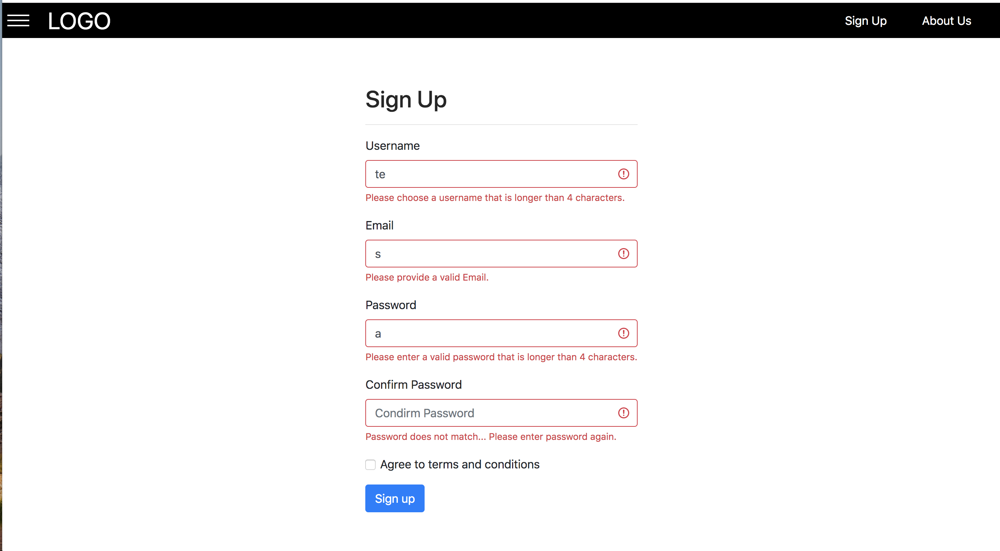

# reactjs-nodejs-mysql-practice-project
###### Will follow MVCSR structure
- Front End
  1. build with react.js and redux thunk
- Back End
  1. build with node.js
  2. With enough middlewares and api, has routes
  3. should have DB migration using mysql rational database
  4. Model built in js (es6)
- Tests
  - front end tests
    1. jest tests towards components and actions
    2. automated tests if necessary

  - back end tests
    1. basic unit tests
    2. intergrations tests for major components
    3. automated tests if necessary

##### This project is for practice purpose, major adjustments in the future is always possible

- app screenshots
  1. #### log in interface
  
  ***
  2. #### sign up fail
  
  ***
  3. #### sign up success
  
  ***
  4. #### log in success
  
  ***
  5. #### user Profile
  
  ***
  6. #### edit profile page
  
  ***
  7. #### create room Modal
  
  ***
  8. #### create room success
  
  ***
  9. #### join Room Modal
  
  ***
  10. #### join room success
  
  ***
  11. #### room message
  
  ***
  12. #### switch room
  
  ***
  13. #### message in different room
  
  ***
  14. #### user in different room
  
  ***